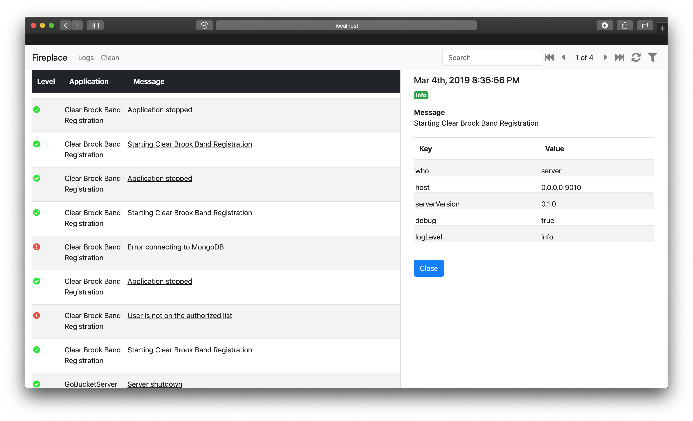

# Fireplace


Fireplace is a set of tools for capturing and viewing structured log entries
from your applications. Currently it is specifically tailored to log entries
coming from Go applications using [https://github.com/sirupsen/logrus](Logrus)
for logging. Fireplace provides a hook which will automatically send logs
to Fireplace Server and capture them into a MongoDB database. Fireplace
Viewer can then be used to sort through logs using a web UI.

### Notice
This project is hardly ready for prime-time, and I only really put it together
for my own personal use. But it is MIT licensed so if you want to use it,
go for it!

### Screenshots




## Fireplace Server
Fireplace Server is a Go application that runs an HTTP server for capturing
and serving up structured log entries.

### Capturing A Log Entry

#### POST: /logentry

#### Payload
A log entry consists of a body in JSON format, with a content type of **application/json**.
The body must look something like this.

```json
{
   "application": "My Application",
   "details": [
      {
         "key": "useful",
         "value": "value"
      }
   ],
   "level": "info",
   "message": "My log message!",
   "time": "2018-07-04T09:39:05Z07:00"
}
```

The payload must be configured in this way. The *details* key can be an
empty array, and not required to contain any values. This key is used
to provide arbitrary key/value pairs of additional data.

*level* must be one of the following:

* debug
* warning
* info
* error
* fatal
* panic

#### Response
Upon successful capture a *200* status code and the new log entry
**ID** will be returned.

### Getting Captured Log Entries

#### GET: /logentry

#### Query Parameters
* **page** - Page number of records to retrieve. 1-based. *Required*
* **application** - Filter results by application name. *Optional*
* **level** - Filter results by level of severity. Must be one of the following: *debug*, *warning*, *info*, *error*, *fatal*, *panic*. *Optional*
* **search** - Filter results by a search term. This will apply against the log message. *Optional*

#### Response
Upon return the payload will return a structure which contains the total count of records, the number of records in this
response, the size of a page, and the collection of matching log entries. Here is a sample.

```json
{
   "count": 10,
   "logEntries": [
      {
         "application": "Create Test Entries 1",
         "details": [
            {
               "key": "additional",
               "value": "Additional 1"
            },
            {
               "key": "who",
               "value": "Main Process"
            }
         ],
         "id": "5b3cde7a85db9e2b16aa4aae",
         "level": "info",
         "message": "This is test message 1",
         "time": "2018-07-04T09:49:30-05:00"
      },
      {
         "application": "Create Test Entries 1",
         "details": [
            {
               "key": "additional",
               "value": "Additional 3"
            },
            {
               "key": "who",
               "value": "Main Process"
            }
         ],
         "id": "5b3cde7a85db9e2b16aa4ab2",
         "level": "error",
         "message": "This is error 1",
         "time": "2018-07-04T09:49:30-05:00"
      }
  ],
   "pageSize": 100,
   "totalCount": 10
}
```

## License
MIT License

Copyright (c) 2018 Adam Presley

Permission is hereby granted, free of charge, to any person obtaining a copy
of this software and associated documentation files (the "Software"), to deal
in the Software without restriction, including without limitation the rights
to use, copy, modify, merge, publish, distribute, sublicense, and/or sell
copies of the Software, and to permit persons to whom the Software is
furnished to do so, subject to the following conditions:

The above copyright notice and this permission notice shall be included in all
copies or substantial portions of the Software.

THE SOFTWARE IS PROVIDED "AS IS", WITHOUT WARRANTY OF ANY KIND, EXPRESS OR
IMPLIED, INCLUDING BUT NOT LIMITED TO THE WARRANTIES OF MERCHANTABILITY,
FITNESS FOR A PARTICULAR PURPOSE AND NONINFRINGEMENT. IN NO EVENT SHALL THE
AUTHORS OR COPYRIGHT HOLDERS BE LIABLE FOR ANY CLAIM, DAMAGES OR OTHER
LIABILITY, WHETHER IN AN ACTION OF CONTRACT, TORT OR OTHERWISE, ARISING FROM,
OUT OF OR IN CONNECTION WITH THE SOFTWARE OR THE USE OR OTHER DEALINGS IN THE
SOFTWARE.
