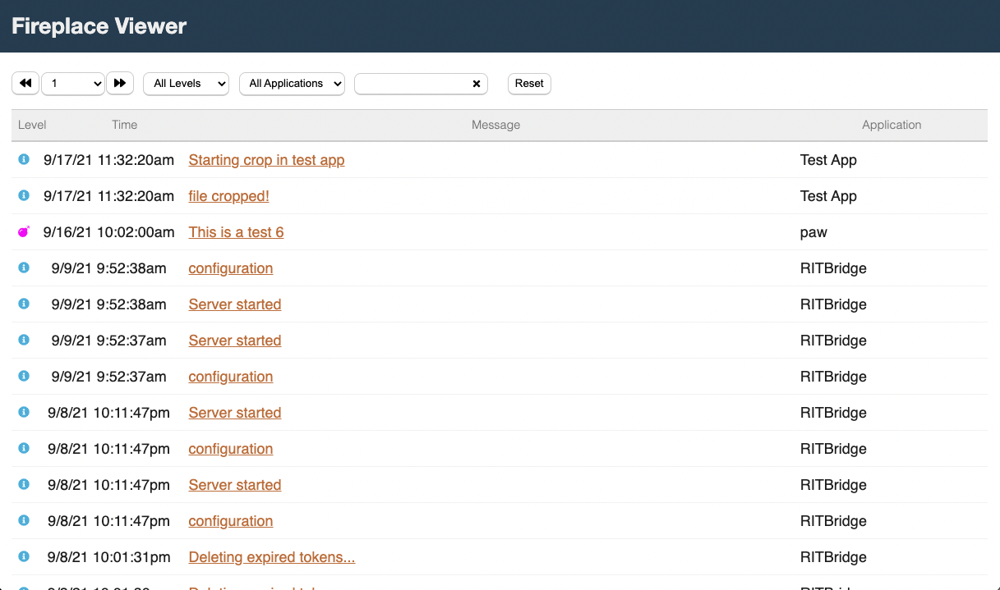

# Fireplace


Fireplace is a set of tools for capturing and viewing structured log entries
from your applications. Currently it is specifically tailored to log entries
coming from Go applications using [https://github.com/sirupsen/logrus](Logrus)
for logging. Fireplace provides a hook which will automatically send logs
to Fireplace Server and capture them into a MongoDB database. Fireplace
Viewer can then be used to sort through logs using a web UI.

### Screenshots




## Getting Started
Fireplace Server is a Go application that runs an HTTP server for capturing
and serving up structured log entries. Fireplace Viewer is a web application
used to view these captured logs.

Here we'll show how to get setup using Docker. If you wish to know more details 
about either the server or viewer, check out their respective READMEs.

* [Fireplace Server README](./cmd/fireplace-server/README.md)
* [Fireplace Viewer README](./cmd/fireplace-viewer/README.md)
* [Fireplace Logrus Hook](./cmd/fireplace-hook/README.md)
* [CSharp Library](./cmd/sharpfireplace/README.md)

### Build and Run from Docker Registry

```bash
docker run --name fireplace -d appnerds/fireplace
```

### Local Docker Build and Run

To run the server, viewer, and database, the first task is to setup an 
environment file. In the root of this repository there is a file named
`env.template`. 

Make a copy of this file and rename it to `.env`. Then open the file
and modify the values for your configuration. Also be sure to include
your private GITHUB_TOKEN. Be sure to use a token that has access to 
the private App Nerds repositories for building.

Now, run the following to build and run.

```bash
docker-compose up
```

Then open your browser to `http://localhost:8090`.

### License

MIT License

Copyright (c) 2021 App Nerds LLC

Permission is hereby granted, free of charge, to any person obtaining a copy
of this software and associated documentation files (the "Software"), to deal
in the Software without restriction, including without limitation the rights
to use, copy, modify, merge, publish, distribute, sublicense, and/or sell
copies of the Software, and to permit persons to whom the Software is
furnished to do so, subject to the following conditions:

The above copyright notice and this permission notice shall be included in all
copies or substantial portions of the Software.

THE SOFTWARE IS PROVIDED "AS IS", WITHOUT WARRANTY OF ANY KIND, EXPRESS OR
IMPLIED, INCLUDING BUT NOT LIMITED TO THE WARRANTIES OF MERCHANTABILITY,
FITNESS FOR A PARTICULAR PURPOSE AND NONINFRINGEMENT. IN NO EVENT SHALL THE
AUTHORS OR COPYRIGHT HOLDERS BE LIABLE FOR ANY CLAIM, DAMAGES OR OTHER
LIABILITY, WHETHER IN AN ACTION OF CONTRACT, TORT OR OTHERWISE, ARISING FROM,
OUT OF OR IN CONNECTION WITH THE SOFTWARE OR THE USE OR OTHER DEALINGS IN THE
SOFTWARE.

