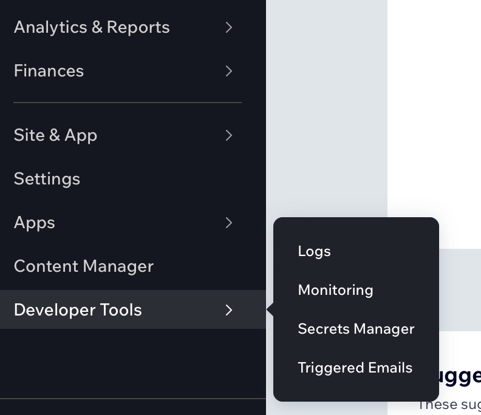
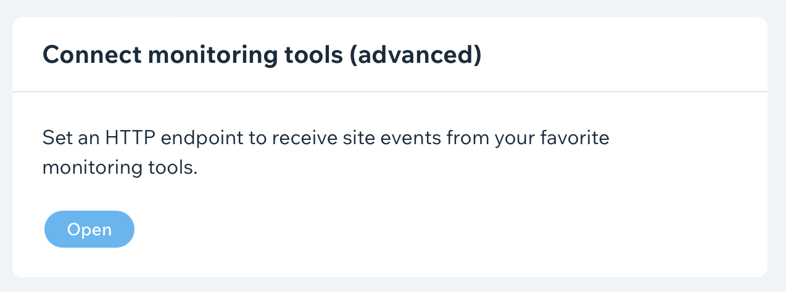
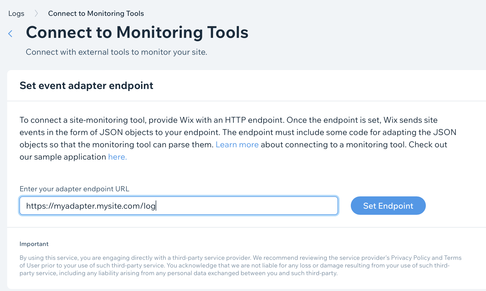

# Wix Fireplace Adapter

The Wix Fireplace Adapter is a service which allows Wix sites to log directly to a Fireplace server. The Wix logging system only really works when you have the tool open and our monitoring it directly. This is not ideal for troubleshooting issues *after* the face. With this adapter you can connect your Wix site to a Fireplace server and capture all log events Wix emits on your site.

## Configuring

Create a `.env` file with the following information:

```
SERVER_HOST=localhost:8081
FIREPLACE_URL=http://localhost:8999
FIREPLACE_PASSWORD=password
LOG_LEVEL=info
```
Replace the values with the correct information. Run this application on server of your choice, then hook your Wix site to this adapter. 

### Securing Access
Please note that the Wix Fireplace Adapter service has no built in security measures. Because the Wix connection does not support any authenticating mechanisms you must take steps to secure acess to the Adapter. One way to achieve this would be to restrict access to the server through IP whitelisting.

## Connecting

To connect your Wix site to the Adapter visit your Wix dashboard. Go first to *Developer Tools* -> *Logs*.



Now click on the *Open* button under **Connect monitoring tools (advanced)**.



Enter the URL to your adapter installation and point it to the `/log` path. It should look something like this: `https://some.myurl.com/log`.



Click on the **Set Endpoint** button to save. 
